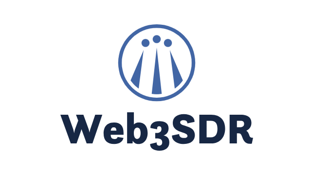

# Welcome

<figure><figcaption>
Decentralized SDR
</figcaption></figure>

**Web3SDR** is a decentralized physical infrastructure network (DePIN) that integrates Software-Defined Radio (SDR) technology with the power of blockchain. Web3SDR transforms the traditional WebSDR platform into a decentralized, scalable, and tokenized system where SDR clients can contribute data from radio signals between 1 MHz and 160 MHz (AM/FM and more), while participating as nodes in a decentralized network. These SDR clients, connected via the TON proxy network, enable secure, censorship-resistant communication and incentivized participation through the **WEB3SDR** token.

This project aims to create a global, accessible SDR infrastructure for enthusiasts, researchers, and developers while ensuring data integrity, privacy, and decentralization.

***

### Tokenomics

#### WEB3SDR Token

**WEB3SDR** is the native token of the Web3SDR network. It powers the ecosystem, serving multiple functions:

**Functions:**

1. **Incentivization**: SDR clients earn WEB3SDR tokens by operating as a node on the network and providing radio signal data.
2. **Payments**: Users who want to access SDR data through the API/SDK pay in WEB3SDR tokens.
3. **Governance**: Token holders participate in network governance, influencing the future development of Web3SDR.

#### Earning Model

**Node Operators (SDR Clients):**

* **Data Contribution**: SDR clients earn tokens by contributing radio signal data to the network.
* **Mining Rewards**: As part of the TON proxy network, they also participate in transaction processing and receive a portion of transaction fees in WEB3SDR tokens.

**Data Consumers:**

* Users pay for accessing radio signal data on a pay-per-use basis. The cost depends on the bandwidth and duration of data usage.

***

### Security and Privacy

#### Decentralization

All SDR clients operate as independent nodes on the TON proxy network, ensuring a decentralized architecture. No single point of failure exists, and data is distributed across various nodes.

#### Censorship Resistance

The TON proxy network is used to ensure that Web3SDR is censorship-resistant. SDR clients cannot be easily blocked or restricted by authorities, ensuring free and open access to radio data.

#### Data Integrity

The integrity of SDR data is secured by the underlying blockchain network. Transactions, data contributions, and token payments are recorded immutably on the ledger, ensuring transparency and security.

***

### Roadmap

#### Phase 1: Proof of Concept (POC)

* Develop and test the first SDR client with Raspberry Pi and SDR hardware.
* Build a basic version of the Web3SDR API.
* Launch a testnet for SDR client connectivity.

#### Phase 2: Token and Network Integration

* Integrate WEB3SDR tokens and the TON proxy network.
* Launch the mining node functionality on SDR clients.
* Deploy a full-featured API and SDK for developers.

#### Phase 3: Mainnet Launch

* Open the network to global users and developers.
* Launch WEB3SDR token distribution through exchanges.
* Expand SDR client support to more hardware configurations.

#### Phase 4: Ecosystem Growth

* Partner with developers and institutions to build use cases for Web3SDR data.
* Expand node participation through incentives and rewards.
